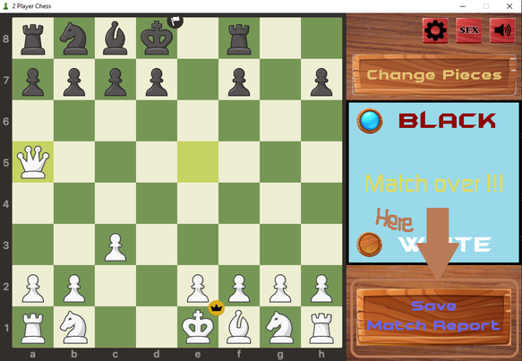
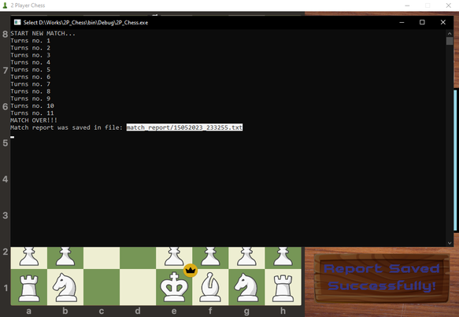
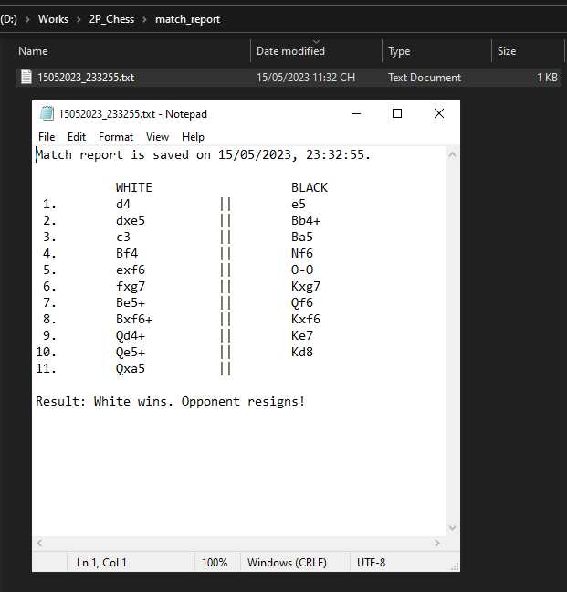

# Two Player Chess
- **Author**: Nguyễn Tân Nguyên - **22021117** - **UET-VNU**

- **Class**: **INT2215 1** (2022-2023)

This is my first game project, as well as the homework for the semester examination.

> About: This game is based on CHESS - a well-known mind sport with chess pieces on a **8x8** board. For more information, please read the chess rules [here](https://chess.com/learn-how-to-play-chess).

## Table of Contents
**[Installation](#installation)**  
**[How to Play](#how-to-play)**  
**[Credits](#credits)**

## Installation
> Note: I have only tried this on **Windows 10**, but it should work fine on other Operating Systems.

* Step 1: Download ZIP and extract files, or clone this repository to your computer.

* Step 2A: If you want to run the game directly without using any IDEs or compilers, copy/cut all files in `bin/Debug/` (include the `.dll` files) to the main folder, then run the execution named `2P_Chess.exe`.

* Step 2B: If you have **Code::Blocks 17.12** or over (I haven't tried on other versions), you could extract `2P_Chess_CB.zip` *to another folder*, open the file `2P_Chess.cbp` inside **Code::Blocks** and click on Button "Compile and Run"/ press F9 to compile and run the codes.

## How to Play

### Basic
The two players will interact with the game with mouse, click everything with your left mouse button :)) . In my opinion, the game is simple enough for everyone to play without the need of reading this.

### Print match report
This is my favorite feature of the game. After playing a match with your opponent, the game could export the match report to a text file (`.txt`). This is really useful when you want to rewatch the match and learn somrthing after a battle.

* Step 1: After a match, you should press the "Save Match Report" button like this:

    

* Step 2: When the button renders "Report Saved Successfully!", go to executable and check if a text file which contains the last match's report was created.

    

* Step 3: Follow the link in the executable (which has the form of `/match_report/(Date_and_Time).txt`) and you will find the report.

    

## Credits

### Code
Most of the code was written by me. Also thanks to some of my friends, especially [Nguyễn Hồng Quân](https://github.com/quanmcvn) for supporting me in implementing some hard parts of this project.

### Images
* The images' format is based on [chess.com](https://chess.com) - the most famous online chess-playing website.

* Buttons' template is found on Internet (so sad that I couldn't ~~remember~~ find where I took that from).

### Sound effects and Music
* All SFXs are from [chess.com](https://chess.com).

* Music used in Game:

    *  **[Pigstep (Stereo Mix)](https://www.youtube.com/watch?v=BTthtlT80Rc&list=OLAK5uy_luAYVTWsWTSov-rb5Y_Q-5LZDCTPaNKfs&index=5)** by **Lena Raine** (From **Minecraft: Nether Update OST** - Track No. 5);

    * **[Sweden](https://www.youtube.com/watch?v=_3ngiSxVCBs)** by **C418** (From **Minecraft - Volume Alpha** - Track No. 18).